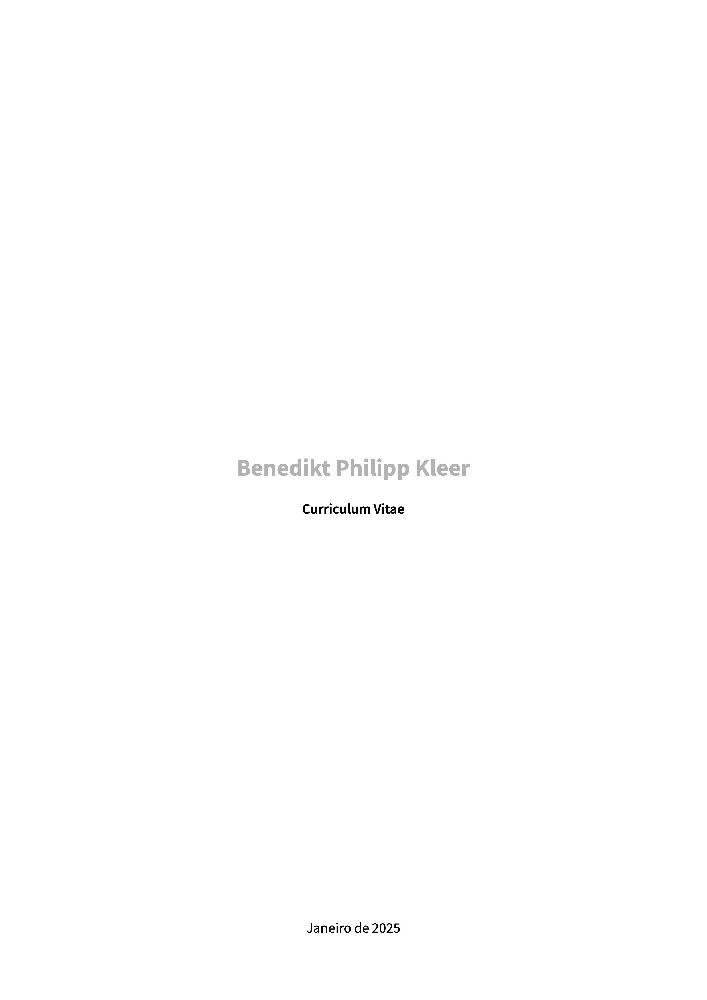
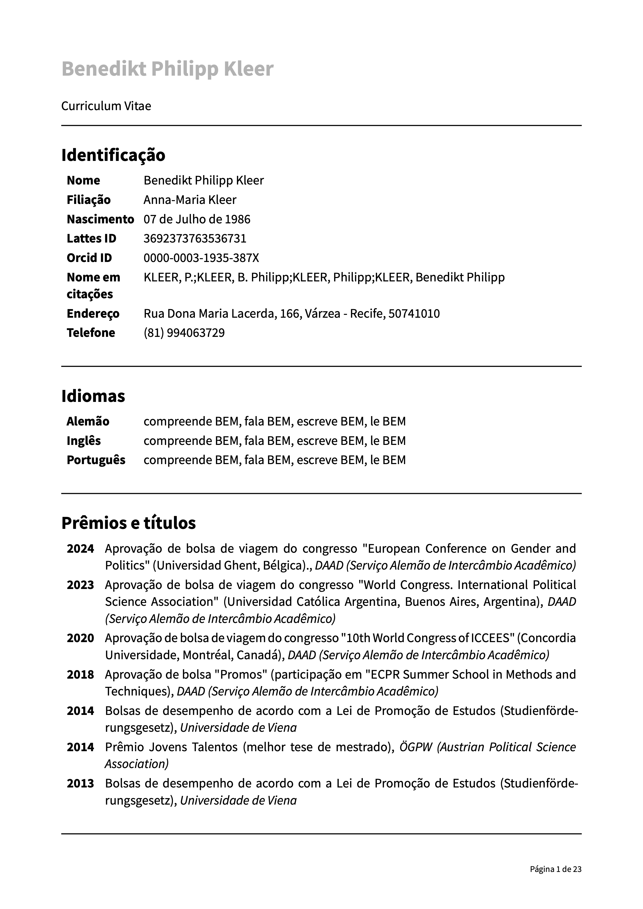
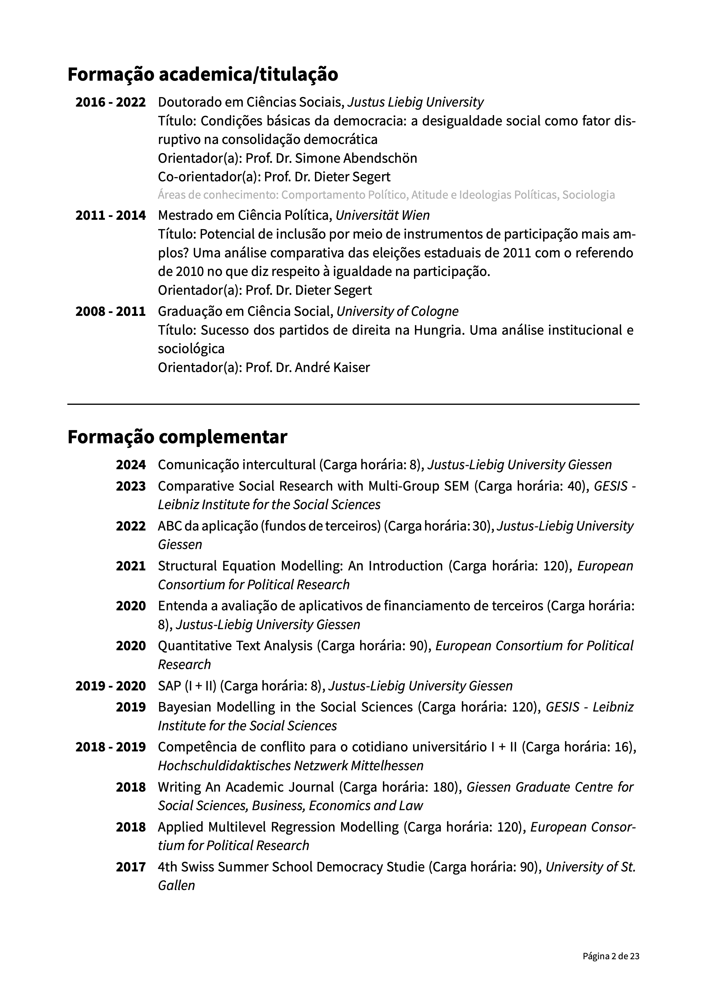
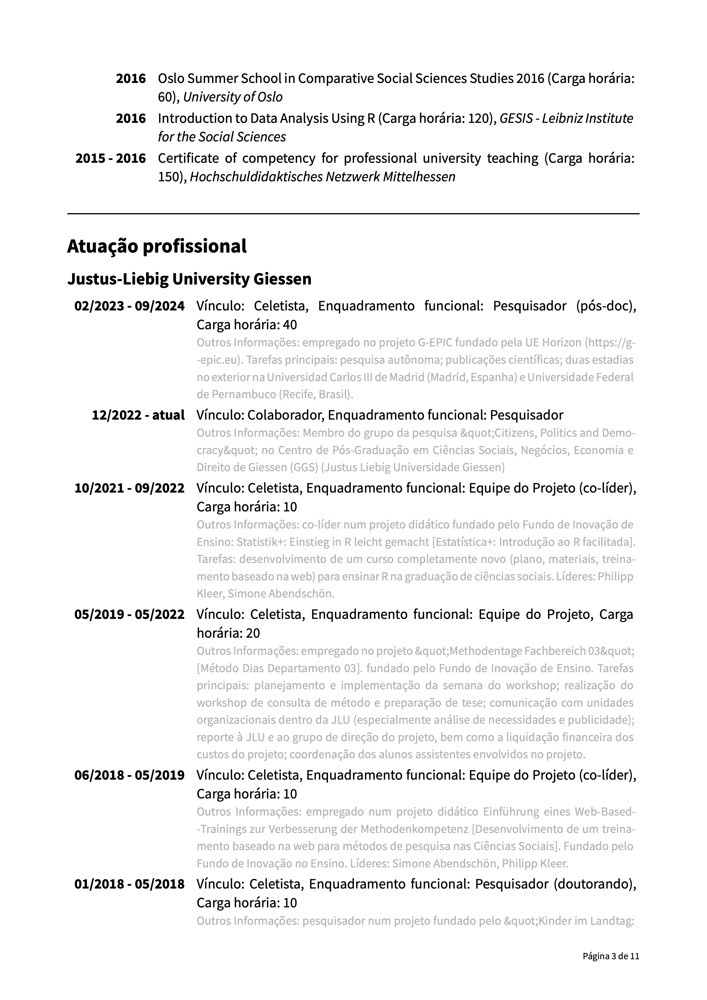
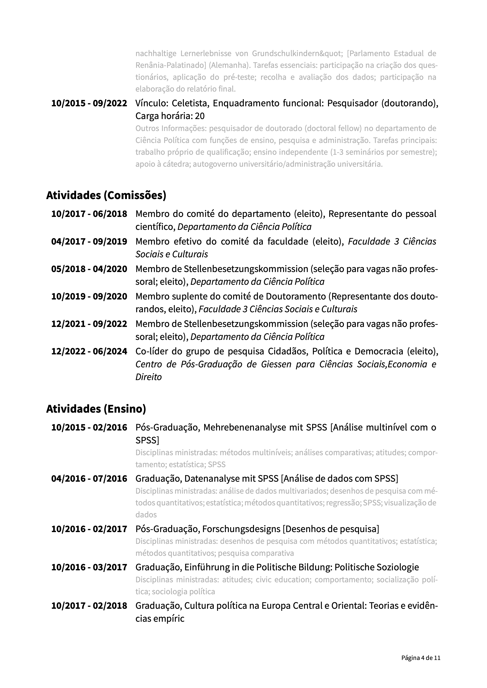

# create-lattes-cv

# 👷🏼‍♀️ ⚠ Ainda em construção, não está pronto para todos os tipos de entradas.

[LATTES](https://lattes.cnpq.br) é uma ótima plataforma para acadêmicos armazenarem todo o seu trabalho científico. No entanto, as opções de exportação são bastante frustrantes, já que a exportação em RTF não resulta em um currículo com uma boa aparência.

Por isso, estou tentando resolver esse problema exportando o arquivo XML e criando este modelo para gerar um PDF bem formatado usando [Typst](https://typst.app). Se você ainda não conhece o [Typst](https://typst.app), ele é uma linguagem muito mais fácil de aprender e um compositor mais rápido do que o LaTeX.

Eu iniciei este projeto e, como no meu currículo do [LATTES](https://lattes.cnpq.br) não estão disponíveis todas as opções possíveis, pode haver erros quando você testá-lo. Você pode abrir uma [issue]() ou criar um pull request com uma solução sugerida. Além disso, este é apenas o começo, então o código pode não estar tão simples e bonito quanto deveria ser.

## Fonts

Eu uso [Source Sans Pro](https://fonts.google.com/specimen/Source+Sans+3), que você pode obter [aqui](https://fonts.google.com/specimen/Source+Sans+3).

## Uso

### Exportar arquivo XML e criar arquivo toml
Como estou mais familiarizado com arquivos toml e seu uso no [Typst](https://typst.app), criei o script em Python `helper.py`, que converte seu arquivo XML do [LATTES](https://lattes.cnpq.br) em um arquivo toml. Para fazer a transformação, basta executar a seguinte linha no terminal, onde o script está localizado:

```bash
python3 helper.py caminho-para-o-seu-arquivo-xml
```

Isso criará o arquivo `meu-arquivo.toml`, que você poderá usar nos documentos do Typst.

### Criando o PDF 

A estrutura do arquivo principal é bastante simples. Você só precisa indicar qual versão do currículo deseja no argumento `kind`: `resumido`, `ampliado` ou `completo`. Dependendo da sua escolha, você utiliza a função específica:

```typst
// Import of libraries
#import "lib.typ": *
#import "@preview/datify:0.1.3": *

#show: lattes-cv.with(
  database: "data/lattes.toml",
  kind: "completo",
  me: "KLEER",
  date: datetime.today()
  last_page: true
)     
```

#### Uso de Typst local

Antes de usar, você precisa instalar ou fazer update para Typst 0.12. Como você poderia instalar é descrevido [aqui](https://github.com/typst/typst).

#### Uso no editor online de Typst
Você poderia usar o editor online de [Typst](https://typst.app) para criar um projeto. Você poderia copiar esse projeto que já tem todos os arquivos (sem o arquivo criado do Lattes): [Link](https://typst.app/project/rDHeKkEoT9UuHDnnH93mQq). Você poderia copiar o projeto para usar.

Antes de executar, você somente precisa fazer o upload do arquivo transformado para `.toml` do Lattes. 

### Uso ou melhorias das funções

Esta é uma primeira abordagem simples para uma solução, e eu ainda não estruturei tudo completamente. O objetivo principal, até o momento, é ter funções para cada área que são chamadas se a área específica estiver presente nos dados XML/TOML.

As variáveis locais (em funções, loops, etc.) têm nomes em português. As variáveis globais têm nomes em inglês (global refere-se ao uso em `lib.typ`).

### O que já está incluído

#### Status de programar a área

👷🏼 : precisa de trabalho (parcialmente codificado)

🎬 : finalizado

⛔️ : ainda não é começado

#### Inclusão no tipo de currículo

❌ : não incluído no tipo

✅ : incluído no tipo

| Área | Coded? | Parte de tipo *completo* | Parte de tipo *ampliado* | Parte de tipo *resumido* | 
| :---------------- | :--:| :--:| :--:| :--:|
| **Identificação** |  🎬 | ✅ | ✅ | ✅ |
| **Licenças** | ⛔️ | ✅ | ❌ | ❌ |
| **Idiomas** | 🎬 | ✅ | ✅ | ❌ |
| **Prêmios e títulos** (provavelmente nem todos tipos) |  👷🏼 | ✅ | ✅ | ❌ |
| **Formação acadêmica** (provavelmente nem todos tipos) | 👷🏼 | ✅ | ✅ | ✅ |
| **Formação complementar** |  🎬 |  ✅ |  ✅ |  ✅ |
| **Atuação profissional** (talvez tenha mais tipos) | 👷🏼 |  ✅ |  ✅ |  ✅ |
| Atuação profissional - Vínculos | 🎬 |  ✅ |  ✅ |  ✅ |
| Atuação profissional - Vínculos - Atividades Comissões (provavelmente não todos tipos) | 👷🏼 |  ✅ |  ✅ |  ✅ |
| Atuação profissional - Vínculos - Atividades Ensino (provavelmente não todos tipos) | 👷🏼 |  ✅ |  ✅ |  ✅ |
| **Projetos** (talvez tenha mais tipos) | 👷🏼 |  ✅ |  ❌ |  ❌ |
| Projetos - Projetos de pesquisa |  🎬 |  ✅ |  ❌ | ❌ | 
| Projetos - Projetos de ensino |  🎬 |  ✅ |  ❌ | ❌ | 
| **Revisor periódico** | 🎬 |  ✅ |  ✅ |  ✅ |
| **Membro de comitê de assessora** | 🎬 |  ✅ |  ✅ |  ✅ |
| **Revisor de projeto de agência de fomento** | 🎬 |  ✅ |  ✅ |  ✅ |
| **Área de atuação** |   🎬 |  ✅ |  ✅ | ❌ | 
| **Produção bibliográfica** (talvez tenha mais tipos) | 👷🏼 | ✅ | ✅ | ✅ |
| Produção bibliográfica - artigos | 🎬 |  ✅ |  ✅ |  ✅ |
| Produção bibliográfica - livros | 🎬 |  ✅ |  ✅ |  ✅ |
| Produção bibliográfica - capítulos de livros | 🎬 |  ✅ |  ✅ |  ✅ |
| Produção bibliográfica - texto em jornal ou revista | ⛔️ | ✅ | ✅ | ✅ |
| Produção bibliográfica - Apresentações de trabalho e palestra | 🎬 |  ✅ |  ❌ | ❌ |
| Produção bibliográfica - Técnicos (somente _Demais produções técnicas_ ) | 👷🏼 |  ✅ |  ✅ | ✅ |
| **Assessoria** | ⛔️ | ✅ | ❌ | ❌ |
| **Extensão tecnológica** |  ⛔️ | ✅ | ❌ | ❌ |
| **Programa de computador sem registro** | ⛔️ | ✅ | ✅ | ✅ |
| **Produtos** |  ⛔️ | ✅ | ✅ | ✅ |
| **Processos** |  ⛔️ | ✅ | ✅ | ✅ |
| **Trabalhos técnicos** |  ⛔️ | ✅ | ✅ | ✅ |
| **Extensão tecnológica** |  ⛔️ | ✅ | ✅ | ✅ |
| **Outras produções técnicas** |  ⛔️ | ✅ | ❌ | ❌ |
| **Entrevistas, mesas redondas, programas e comentários na mídia** |  ⛔️ | ✅ | ❌ | ❌ |
| **Redes sociais, websites, blogs** |  ⛔️ | ✅ | ✅ | ✅ |
| **Produção artista/cultural** | ⛔️ | ✅ | ✅ | ✅ |
| **Patentes e registros** | ⛔️ | ✅ | ❌ | ❌ |
| **Inovação** | 👷🏼 | ✅ | ❌ | ❌ |
| Inovação - Projeto de ensino (tem mais tipos de inovação) | 👷🏼 |  ✅ |  ❌ | ❌ |
| **Educação e Popularização de C&T** | 👷🏼 |  ✅ |  ❌ | ❌ |
| Educação e Popularização de C&T - Apresentação de trabalho e palestra | ✅ |  ✅ |  ❌ | ❌ |
| **Orientaçãoes e Supervisões** | 👷🏼 | ✅ | ✅ | ✅ |
| Orientações e Supervisões - em andamento (not tested yet) | 👷🏼 | ✅ | ✅ | ✅ |
| Orientações e Supervisões - em andamento - graduação (not tested yet) | 👷🏼 | ✅ | ✅ | ✅ |
| Orientações e Supervisões - em andamento - mestrado (not tested yet) | 👷🏼 | ✅ | ✅ | ✅ |
| Orientações e Supervisões - em andamento - doutorado (not tested yet) | 👷🏼 | ✅ | ✅ | ✅ |
| Orientações e Supervisões - concluídas | 👷🏼 | ✅ | ✅ | ✅ |
| Orientações e Supervisões - concluídas - graduação (not all types tested) | 👷🏼 | ✅ | ✅ | ✅ |
| Orientações e Supervisões - concluídas - mestrado | 🎬 | ✅ | ✅ | ✅ |
| Orientações e Supervisões - concluídas - doutorado (not tested) | 👷🏼 | ✅ | ✅ | ✅ |
| **Eventos** | 👷🏼 |  ✅ |  ❌ | ❌ |
| Eventos - Participação em eventos | 🎬 |  ✅ |  ❌ | ❌ |
| **Bancas** | 👷🏼 |  ✅ |  ❌ | ❌ |
| Bancas - Participação em banca de trabalhos de conclusão | 👷🏼 |  ✅ |  ❌ | ❌ |
| Bancas - Participação em banca de trabalhos de conclusão - graduação (not tested) | 👷🏼 |  ✅ |  ❌ | ❌ |
| Bancas - Participação em banca de trabalhos de conclusão - mestrado | 🎬 | ✅ |  ❌ | ❌ |
| Bancas - Participação em banca de trabalhos de conclusão - doutorado (not tested) | 👷🏼 |  ✅ |  ❌ | ❌ |
| **Citações** | ⛔️ | ✅ | ❌ | ❌ |
| **Totais de produções** (você poderia escolher também para resumido e ampliado) | 👷🏼 | ✅ | ❌ | ❌ |
| **Outras informações relevantes** | ⛔️ | ✅ | ❌ | ❌ |

## Exemplos ("completo")










